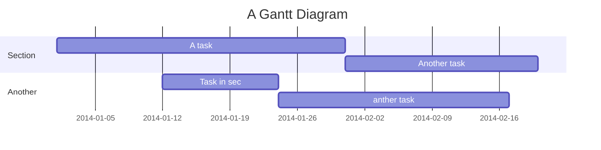

+++
title = "Diagram Guide"
description = "Guide to diagram usage in Markdown"
date = 2021-09-01T11:36:50+08:00
featured = false
draft = false
comment = false
toc = true
reward = true
diagram = true
categories = [
  "Markdown"
]
tags = [
  "Diagram"
]
series = [
  "Docs"
]
+++

This article offers a sample of basic diagram usage that can be used in Hugo content files.

Please see also [Mermaid](https://mermaid-js.github.io).
<!--more-->

## Flow Chart


graph TD
    A[Christmas] -->|Get money| B(Go shopping)
    B --> C{Let me think}
    C -->|One| D[Laptop]
    C -->|Two| E[iPhone]
    C -->|Three| F[fa:fa-car Car]


## Sequence Diagram


sequenceDiagram
    Alice->>+John: Hello John, how are you?
    Alice->>+John: John, can you hear me?
    John-->>-Alice: Hi Alice, I can hear you!
    John-->>-Alice: I feel great!


## Class Diagram


classDiagram
    Animal <|-- Duck
    Animal <|-- Fish
    Animal <|-- Zebra
    Animal : +int age
    Animal : +String gender
    Animal: +isMammal()
    Animal: +mate()
    class Duck{
      +String beakColor
      +swim()
      +quack()
    }
    class Fish{
      -int sizeInFeet
      -canEat()
    }
    class Zebra{
      +bool is_wild
      +run()
    }


User flows
---
```sequence
Alice->Bob: Hello Bob, how are you?
Note right of Bob: Bob thinks
Bob-->Alice: I am good thanks!
Note left of Alice: Alice responds
Alice->Bob: Where have you been?
```

> Read more about sequence-diagrams here: http://bramp.github.io/js-sequence-diagrams/

Project Timeline
---


> Read more about mermaid here: http://mermaid-js.github.io/mermaid/